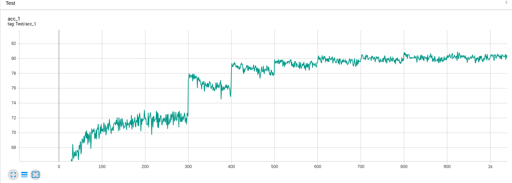
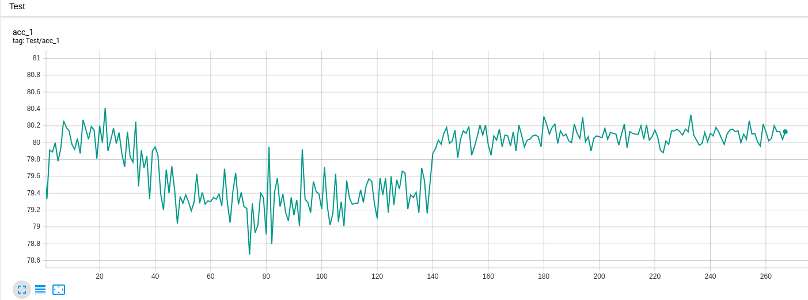
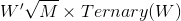
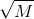
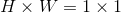

# MSUNet-v3
MSUNet-v3 is a deep convolutional neural network that competes in the CIFAR-100 image classification task in the 2019 NeurIPS MicroNet Challenge. 

It exploits the power of mixed depthwise convolution, quantization and sparsification to achieve lightweight yet effective network architecture.

### Results

|Model | Top-1 Test Accuracy | #Flops | #Parameters| Score|
|---|---|---|---|---|
|[MSUNet-v1](https://github.com/zhengyu998/MSUNet-v1)| 80.47%| 118.6 M| 0.2119 M | 0.01711 |
|[MSUNet-v2](https://github.com/zhengyu998/MSUNet-v2)| 80.30% | 97.01 M | 0.1204 M | 0.01255 |
|MSUNet-v3| 80.13% | 85.27 M | 0.09853 M | 0.01083 |


We follow the training-and-pruning pipeline, where we first train a network with ternary weights and then prune the network to further sparsify the squeeze-excitation and dw-conv layers and quantize the weights to FP16 in the meantime.
 
**The test accuracy in the training stage:**



**The test accuracy in the pruning stage:**

Note that the model reached the target sparsity after 100 epochs.


### Design details

MSUNet is designed based on four key techniques: 1) ternary conv layers, 2) sparse conv layers, 3) quantization and 4). self-supervised consistency regularizer.
The details of these techniques are briefly described below. 

In terms of implementation, we use pytorch to implement our model. Our repository is built on top of [pytorch-image-models](https://github.com/rwightman/pytorch-image-models) (by Ross Wightman).

* **Ternary convolutional layers**

    * Some convolutional layers are ternarized, i.e., the weights are either -1, 0 or +1. 
    * Although our implementation allows binary weight, we find that ternary weights generally perform better than binary. Therefore, we stick to ternary weights for some convolution layers.
    * We follow an approach similar to [Training wide residual networks for deployment using a single bit for each weight](https://arxiv.org/abs/1802.08530) to represent the ternary weights, that is, 
     where *W* is the weight, *Ternary(W)* quantizes the weight to (-1,0,+1) and  is a FP16 multiplier that scales all the weights in a particular convolutional layer. 
    
    * The code snippet that reflects the ternary operation in `validate.py` is as below
    ```python
    class ForwardSign(torch.autograd.Function):
    @staticmethod
    def forward(ctx, x):
        global alpha
        x_ternary = (x - x.mean())/x.std()
        ones = (x_ternary > alpha).type(torch.cuda.FloatTensor)
        neg_ones = -1 * (x_ternary < -alpha).type(torch.cuda.FloatTensor)
        x_ternary = ones + neg_ones
        multiplier = math.sqrt(2. / (x.shape[1] * x.shape[2] * x.shape[3]) * x_ternary.numel() / x_ternary.nonzero().size(0) )
        if args.amp:
            return (x_ternary.type(torch.cuda.HalfTensor), torch.tensor(multiplier).type(torch.cuda.HalfTensor))
        else:
            return (x_ternary.type(torch.cuda.FloatTensor), torch.tensor(multiplier).type(torch.cuda.FloatTensor))
          
    ```
    * As there is a scale factor  for the weights and we are implementing fake quantization, we assume that the multiplicatin of scale factor  is performed **after** convolving the input with ternary weights. 
    * Also note that as the ternary weights tend to be sparse in our implementation, we assume that they are compatible with sparse matrix storage and sparse math operation.
    * Therefore, the overall flops is calculated from three parts: 1) sparse 1-bit (-1, 1) multiplication in the convolution operation; 2) sparse FP32 addition in the convolution operation; and 3) FP16 multiplication for multiplying the scale factor on the output of the layer.
    * And the number of parameters is calculated from three parts: 1) 1-bit (-1,1) representation of the non-zero values in weights; 2) bitmask of the full weights; 3) an FP16 scale factor for each convolutional layer.
 
* **Sparse Squeeze-excitation and dw-conv layers**
    * Same as [pytorch-image-models](https://github.com/rwightman/pytorch-image-models), we use 1x1 convolution performed on features with spatial dimension  to perform squeeze-and-excitation, which is equivalent to the fully connected layer implementation.
    * In order to make the weights sparse, we perform pruning on the weights of squeeze-excitation layers and dw-conv layers.
    * Therefore, the number of additions and multiplication comes from the sparse 1x1 conv or dw-conv, that is, 1) 16-bit multiplication, and 2) 32-bit addition.
    * And the number of parameters comes from two parts: 1) FP16 non-zeros values of the weights; 2) bitmask of the full weights.

* **Mixed Precision**
    * We implement mixed precision training using NVIDIA's [`apex.amp`](https://github.com/NVIDIA/apex) tool with **`opt_level=O2`**, which casts the model weights to FP16, patches the model's `forward` method to cast data to FP16, 
    and keeps batchnorms in FP32 at **training time** for numerical stability purpose.
    * **At test time**, we implement mixed precision using [`apex.amp`](https://github.com/NVIDIA/apex) with **`opt_level=O3`**, which further **casts the batch normalization layers to FP16** with little affect on the testing accuracy. 
    
* **Cutmix + self-supervised consistency regularizer**
   * During training, we use cutmix as a data augmentation technique. In addition, we propose a self-supervised consistency regularizer, enforcing feature-level consistency between cutmix data points in the feature space and the mixed features of individual data points without using the label information. We found it helps to predict consistent soft-labels at cutmix points and observed further accuracy improvement in the training.
    
    

* **Scoring**
    * The flops and parameters are counted by their respective forward hooks.
    * As stated previously, layers with ternary weights are counted as sparse 1-bit multiplications, sparse 32-bit additions and sparse 1-bit matrix storage. We include the following code in `counting.py` to calculate the sparsity, bit mask and quantization divider:
    ```python
        # For nn.Conv2d:    d is the quantization denominator for non-ternary/binary weights and operations
        #                   bd is the quantization denominator for ternary/binary weights and operations
        
        # For 32-bit full precision:    d==1
        # For 16-bit half precision:    d==2
        # Note that the additions inside GEMM are considered FP32 additions
        d = get_denominator(m, input, output)

        if isinstance(m, nn.Conv2d):
            # Normal convolution, depthwise convolution, and 1x1 pointwise convolution,
            # with sparse and/or ternary/binary weights are all handled in this block.

            c_out, c_in, k, k2 = m.weight.size()
            # Square kerenl expected
            assert k == k2, 'The kernel is not square.'

            if hasattr(m, '_get_weight'):
                # The module having _get_weight attributed is Ternarized.

                # Ternary weight is considered as sparse binary weights,
                # so we use a quantization denominator 32 for multiplication and storage.
                bd = 32 # denominator for binary mults and parameters
                if binarizable == 'T':
                    # Using ternary quantization
                    #print('Using Ternary weights')

                    # Since ternary weights are considered as sparse binary weights,
                    # we do have to store a bit mask to represent sparsity.
                    local_param_count += c_out * c_in * k * k / 32
                    sparsity = (m._get_weight('weight')[0].numel() - m._get_weight('weight')[0].nonzero().size(0)) / m._get_weight('weight')[0].numel()

                    # Since our ternary/binary weights are scaled by a global factor in each layer,
                    # we do have to store a FP32/FP16 digit to represent it.
                    local_param_count += 1 / d # The scale factor
                elif binarizable == 'B':
                    # Using binary quantization
                    # Although we support binary quantization, our we prefer to use ternary quantization.
                    #print('Using Binary weights')
                    # The FP32/FP16 scale factor
                    local_param_count += 1 / d
                    sparsity = 0
                else:
                    raise ValueError('Option args.binarizable is incorrect')

                # Since our ternary/binary weights are scaled by a global factor, sqrt(M), in each layer,
                # which can be considered as multiplying a scale factor on the output of the sparse binary convolution.
                # We count it as FP32/FP16 multiplication on the output.
                local_flop_mults += np.prod(output.size()) / d
      
        ...
      
            # Number of parameters
            # For sparse parameters:                sparsity > 0
            # For dense parameters:                 sparsity=0
            # For 1-bit binary parameters:          bd==32
            # For 32-bit full precision parameters: bd==1
            # For 16-bit half precision parameters: bd==d==2
            # For depthwise convolution:            c_in==1
            local_param_count += c_out * c_in * k * k / bd * (1-sparsity)

            # Number of multiplications in convolution
            # For sparse multiplication:                sparsity > 0
            # For dense multiplication:                 sparsity=0
            # For 1-bit binary multiplication:          bd==32
            # For 32-bit full precision multiplication: bd==1
            # For 16-bit half precision parameters:     bd==d==2
            # For depthwise convolution:                c_in==1
            local_flop_mults += (k * k * c_in) * (1-sparsity) * np.prod(output.size()) / bd

            # Number of full or half precision (32-bit/16-bit) addition in convolution
            # For 32-bit full precision addition
            local_flop_adds += (k * k * c_in * (1-sparsity) - 1) * np.prod(output.size())

            # The parameters and additions for the bias
            # For 32-bit full precision parameters:    d==1
            # For 16-bit half precision parameters:    d==2
            # Note that additions are in 32-bit full precision
            if m.bias is not None:
                local_param_count += c_out / d
                local_flop_adds += np.prod(output.size())

    ```
    * The squeeze-excitation and dw-conv layers are also sparse, but we did not separate them from the normal convolution layers for implementation convenience. 
    We thus include the following code in `counting.py` to find the sparse squeeze-excitation and dw-conv layers and calculate the corresponding sparsity, bit mask and quantization divider:
    ```python
            ...
        
            else:
                # No binarization/ternarization is performed
                # However, we can still choose from full precision (FP32) or half precision (FP16)
                # Therefore, denominator for mults, adds and parameter storage all equal to d
                bd = d

                # Some layers are sparsed, we count those layers that have sparsity > 0.5
                sparsity_ = (m.weight.numel() - m.weight.nonzero().size(0)) / m.weight.numel()
                # The layers with sparsity < 0.4 does not count
                if sparsity_ < 0.4:
                    sparsity = 0
                # 6 squeeze-excitation conv layers and most dw-conv layers have sparsity > 0.4
                else:
                    sparsity = sparsity_
                    # The bit mask for sparse weights
                    local_param_count += c_out * c_in * k * k / 32
            ...
          
            # Number of parameters
            # For sparse parameters:                sparsity > 0
            # For dense parameters:                 sparsity=0
            # For 1-bit binary parameters:          bd==32
            # For 32-bit full precision parameters: bd==1
            # For 16-bit half precision parameters: bd==d==2
            # For depthwise convolution:            c_in==1
            local_param_count += c_out * c_in * k * k / bd * (1-sparsity)

            # Number of multiplications in convolution
            # For sparse multiplication:                sparsity > 0
            # For dense multiplication:                 sparsity=0
            # For 1-bit binary multiplication:          bd==32
            # For 32-bit full precision multiplication: bd==1
            # For 16-bit half precision parameters:     bd==d==2
            # For depthwise convolution:                c_in==1
            local_flop_mults += (k * k * c_in) * (1-sparsity) * np.prod(output.size()) / bd

            # Number of full or half precision (32-bit/16-bit) addition in convolution
            # For 32-bit full precision addition
            local_flop_adds += (k * k * c_in * (1-sparsity) - 1) * np.prod(output.size())

            # The parameters and additions for the bias
            # For 32-bit full precision:    d==1
            # For 16-bit half precision:    d==2
            # Note that additions are in 32-bit full precision
            if m.bias is not None:
                local_param_count += c_out / d
                local_flop_adds += np.prod(output.size())

    ```
    * Since the convolution and batch normalization are all performed with FP16 precision at test (inference) time, we can count the batch normalization as merged. 
    However, as the convolution before batch normalization does not supply **bias**, we can only merge the parameters and flops related to the multiplication operation of batch normalization, 
    and the parameters and flops related to additions in batch normalization is calculated explicitly using the following code:
    ```python
      elif isinstance(m, nn.BatchNorm2d):
            # Is the conv-layers quantized to FP16?
            using_FP16_for_conv = args.amp and args.opt_level != 'O0'
            if d == 1 and using_FP16_for_conv:
                # BatchNorm2d is performed with FP32 precision as indicated by d==1
                # Conv2d is performed with FP16 as indicated using_FP16_for_conv==True
                # We cannot merge BatchNorm2d with Conv2d, since they are performed with different precision
                print('Batchnorm cannot be merged.')
                local_param_count += 2 * input[0].size(0) * input[0].size(1) / d
                local_flop_adds += 1 * np.prod(input[0].size()) / d
                local_flop_mults += 1 * np.prod(input[0].size()) / d
            
            elif (d == 1 and not using_FP16_for_conv) or (d==2 and using_FP16_for_conv):
                print('Batchnorm can be merged')
                # BatchNorm2d and Conv2d are preformed using the same precision (FP32 or FP16)
                # We can then merge BatchNorm2d with Conv2d since they are performed with the same precision
                # However, because the Conv2d before BatchNorm2d does not supply bias term,
                # we can only merge the multiplication part, but not the addition part.
                # We then need to calculate the parameters and flops related to the additions in BatchNorm2d layers explicitly.
                local_param_count += 1*input[0].size(0) * input[0].size(1) / d # The parameters related to additions, which cannot
                                                                               # be merged to the non-existing bias of previous conv-layer
                local_flop_adds += 1*np.prod(input[0].size()) / d # The flops related to additions,
                                                                  # which cannot be merged to non-existing bias of previous conv-layer
            else:
                raise RuntimeError("Unsupported quantization scheme for batchnorm")
    ```
    

### Evaluation
* **Requirements**
    * torch>=1.2.0
    * torchvision >= 0.4.0
    * pyyaml
    * tensorbarodX
    * Apex
    ```bash
    conda create -n MSUnet python=3.6
    conda activate MSUnet
    conda install pytorch torchvision cudatoolkit=10.0 -c pytorch
    conda install pyyaml
    pip install tensorboardX
  
    git clone https://github.com/NVIDIA/apex
    cd apex
    pip install -v --no-cache-dir --global-option="--cpp_ext" --global-option="--cuda_ext" ./
    ```
    Currently we only support running on a signle GPU.
    
* **Validate the accuracy with pretrained checkpoint**

To validate the accuracy for **MSUNet-v3** with a pretrained checkpoint, please run
```bash
python validate.py ~/Downloads/Data/CIFAR100 --model MSUnet_CIFAR100 --num-classes 100 --batch-size 32 -j 8 --img-size 32 --binarizable T --alpha 0.67749 \
 --initial-checkpoint ./output/train/20191010-232631-MSUnet_CIFAR100-32/Last/checkpoint-260.pth.tar \
 --amp --opt-level O3
```

* **Validate the score with pretrained checkpoint**

To validate the score for **MSUNet-v3** with a pretrained checkpoint, please run
```bash
python counting.py --binarizable T --initial-checkpoint ./output/train/20191010-232631-MSUnet_CIFAR100-32/Last/checkpoint-260.pth.tar \
--amp --opt-level O3
```
Note that although at pruning stage we use **`--opt-level O2`**, at testing (inference) stage we use **`--opt-level O3`** to further cast batch normalization
layer to FP16. This implementation further reduces the number of parameters and flops with little affect on the testing accuracy.

* **Train the network from scratch**

We follow the training-and-pruning pipeline, where we first train a network with ternary weights and then prune the network to further sparsify the squeeze-excitation and dw-conv layer. 

To train the network with ternary weights from scratch, please run
```bash
python train_consistency.py ~/Downloads/Data/CIFAR100 --model MSUnet_CIFAR100 --num-classes 100 --lr 0.1 --epochs 1040 --start-epoch 0 --sched step --decay-epochs 300 400 500 600 700 800 900 1000 --decay-rate 0.25 --batch-size 64 -j 8 --opt sgd --warmup-epochs 5 --img-size 32 --drop 0.0 --binarizable T --mixup 1.0 --cutmix_prob 0.5 --softmax-multiplier 1.0 --no-prefetcher
```

After training is finished, we then prune the weights of squeeze-excitation and dw-conv layers from the checkpoint generated from the above script, along with mixed precision training 
or pruning both squeeze-excitation and dw-conv at the same time with 16-bit floating point training by running
```bash
python train_consistency.py ~/Downloads/Data/CIFAR100 --model MSUnet_CIFAR100 --num-classes 100 \
 --sched step --batch-size 64 -j 8 --opt sgd --img-size 32 --drop 0.0 --binarizable T \
 --resume ./output/train/20191009-194002-MSUnet_CIFAR100-32/Last/checkpoint-1035.pth.tar \
 --start-epoch 0 --warmup-epochs 0 --epochs 265 --lr 1e-3 --reset-lr-scheduler 1e-3 --decay-rate 0.25 --decay-epochs 120 170 200 220 250 \
 --alpha 0.67749 --freeze-binary --prune --pruner V2 \
 --mixup-off-epoch 140 --mixup 1.0 --cutmix_prob 0.5 --softmax-multiplier 1.0 --no-prefetcher \
 --amp --opt-level O2
``` 

### Member
* Yu Zheng*
* Shen Yan*
* Mi Zhang
* Xiao Zeng
* Biyi Fang
